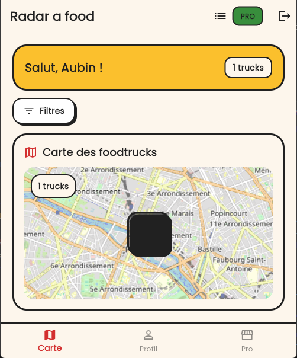

# FoodTrack 🍔🗺️

**FoodTrack** est une application Flutter open source qui te permet de **localiser les food trucks partout en France**, découvrir leurs menus et suivre l’activité “du grill” en temps réel.

> Une expérience **rétro, chaleureuse et néo-brutaliste adoucie** : stickers, ombres nettes, micro-copies complices.

---

## ✨ Démarrer rapidement

- Une app mobile **Flutter**
- Une carte **OpenStreetMap** (via `flutter_map`)
- Une auth **Supabase**
- Un backend **Node.js / Express** (idée d’API + temps réel)
- Une base **PostgreSQL + PostGIS**

---

## 🚀 Fonctionnalités

### Image



### 👥 Pour les utilisateurs

- **Carte interactive** des food trucks
- **Recherche** + **filtres** (ouverts maintenant, type, etc.)
- **Fiches food truck** : menu du jour & horaires
- **Avis** et **favoris**
- **Itinéraire GPS** (au minimum via deep-link)

### 🧑‍🍳 Pour les propriétaires (Pro)

- Compte professionnel
- Position GPS **en temps réel**
- Gestion **menu** et **horaires**
- Gestion/édition des contenus (photos en phase suivante)
- Publication dans le **fil d’actualité**

---

## 🧱 Direction Artistique (DA)

L’interface suit une direction claire :

- **Rétro & gourmand** : couleurs vintage + typographies marquées
- **Néo-brutaliste adouci** : angles arrondis + bordures noires épaisses
- **Ombres nettes** (offset clair/visuel) : effet “objet physique”
- Cartes & cards en mode **sticker** (contour noir prononcé)

Objectif : une UI lisible, performante et pleine de personnalité.

---

## 🗺️ Stack technique

### Frontend

- **Flutter** + **Dart**
- `flutter_map` + **OpenStreetMap**
- `geolocator` (géolocalisation)
- **Provider** (gestion d’état)
- `google_fonts` (typos)

### Backend

- **Node.js** + **Express**
- WebSocket (temps réel)

### Données

- **PostgreSQL**
- **PostGIS** (géospatial)

### Authentification

- **Supabase Auth**

---

## 🧭 Roadmap (par phases)

### V1 — Les bases qui font plaisir

- Carte
- Recherche
- Fiche food truck (menu + horaires)

### V2 — Construire une communauté

- Comptes
- Avis
- Favoris

### V3 — Du “temps réel” qui claque

- Mise à jour de positions / événements
- Notifications

### V4 — Public API & fonctionnalités avancées

- Commande
- Paiement
- API publique documentée

---

## ✅ Ce qui est déjà prévu / structuré

- Architecture Flutter orientée **Clean Architecture**
- Écrans de base : Splash → Home, connexion & inscription
- Intégration OpenStreetMap
- Géolocalisation utilisateur
- Backend prêt à s’intégrer (API + WebSockets)
- PostgreSQL + PostGIS (modèle géospatial)
- Supabase Auth
- Démarrage de la stack via **Docker Compose** (objectif)
- CI/CD via **GitHub Actions** (objectif)

---

## 📁 Arborescence (repère)

```text
foodtruck-france/
├── app/
├── backend/
├── database/
├── docs/
├── assets/
├── scripts/
└── README.md
```

---

## 🧑‍💻 Contribuer

FoodTrack est open source : tu peux contribuer aux écrans, au backend, aux performances et à la direction artistique.

- Ouvre des issues pour proposer des features/améliorations
- Crée des PR avec un résumé clair des changements

> Astuce : la feuille de route est détaillée dans le dossier `Markdown/`.

---

## 📄 Licence

**MIT** — voir le fichier `LICENSE`.
