<div align="center">

# FoodTrack

**Localise les food trucks autour de toi, découvre leurs menus et suis leur activité en temps réel.**


_Une expérience rétro, chaleureuse et néo-brutaliste adoucie : stickers, ombres nettes et micro-copies complices._

</div>

---

## Aperçu

**FoodTrack** est une application mobile open source qui connecte les amateurs de street-food aux food trucks. Grâce à une carte interactive, tu peux :

- **Trouver** les food trucks autour de toi, en temps réel ;
- **Découvrir** leurs menus du jour, leurs horaires et leurs avis ;
- **Suivre** leurs positions GPS mises à jour en direct ;
- **Écrire** ton avis et **signaler** les problèmes rencontrés.

Une expérience pensée pour la communauté **et** pour les food trucks : les propriétaires disposent d'un espace **Pro** complet pour gérer leur fiche, leur menu et leur position.

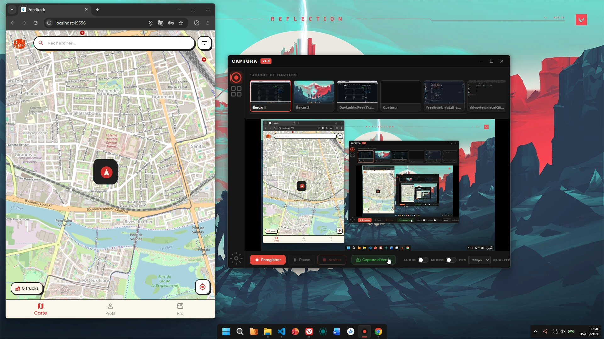
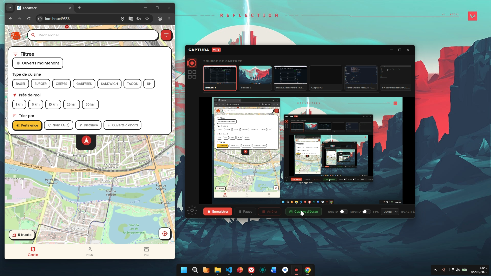
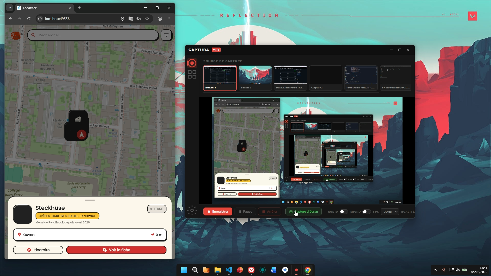
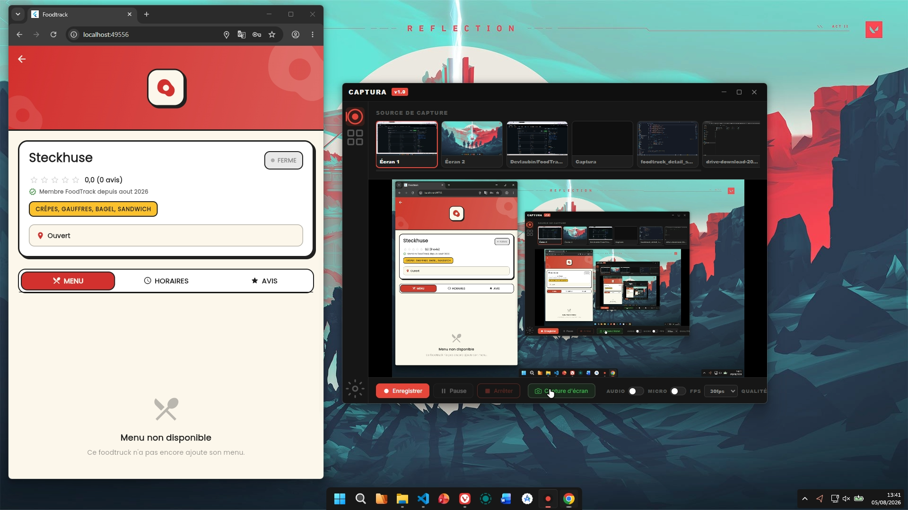
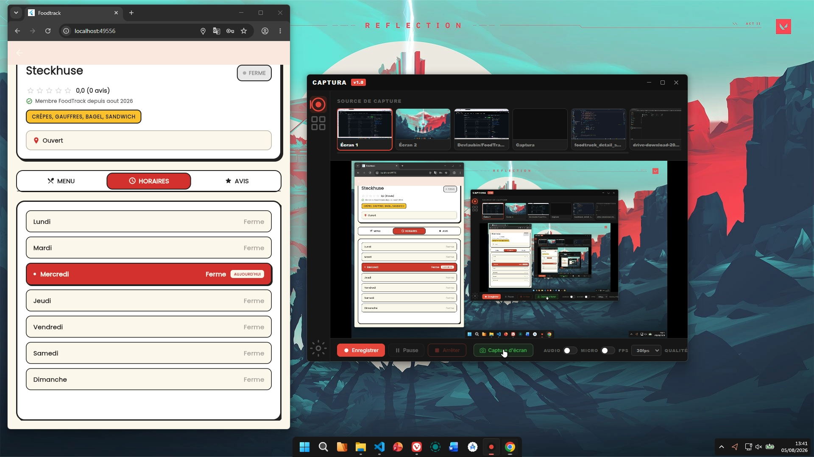
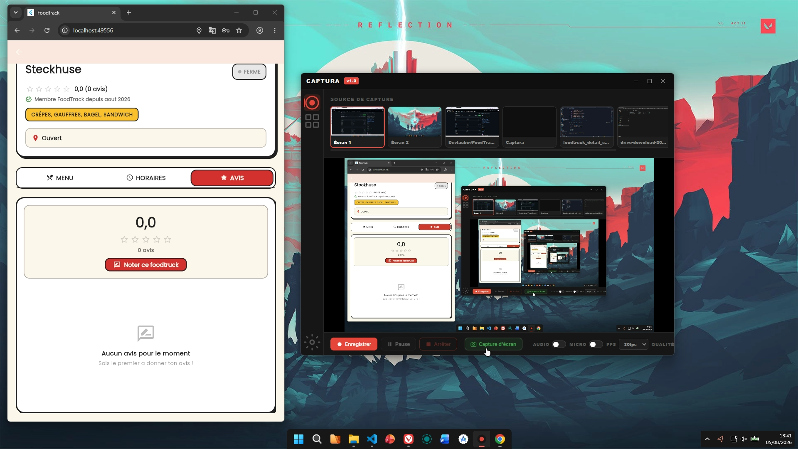
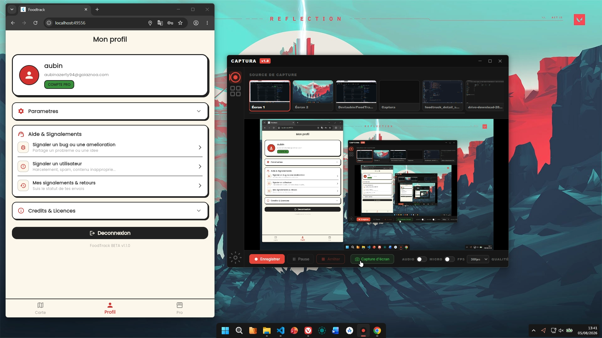
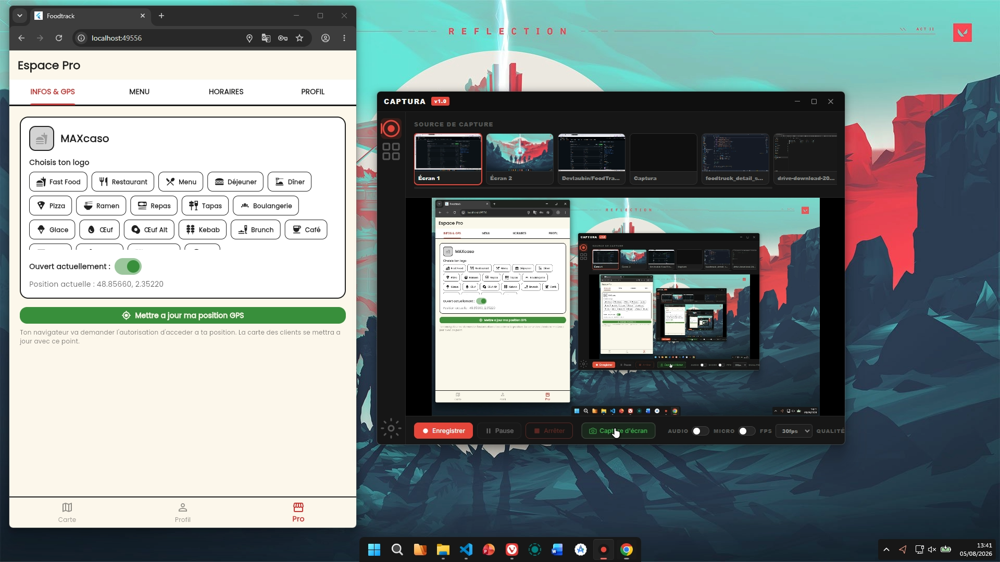
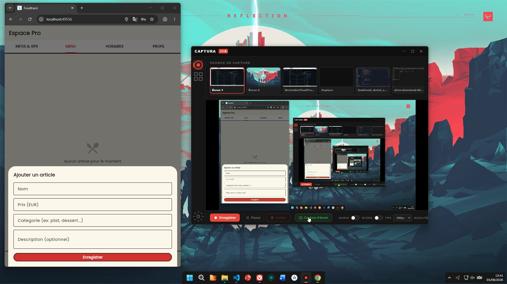
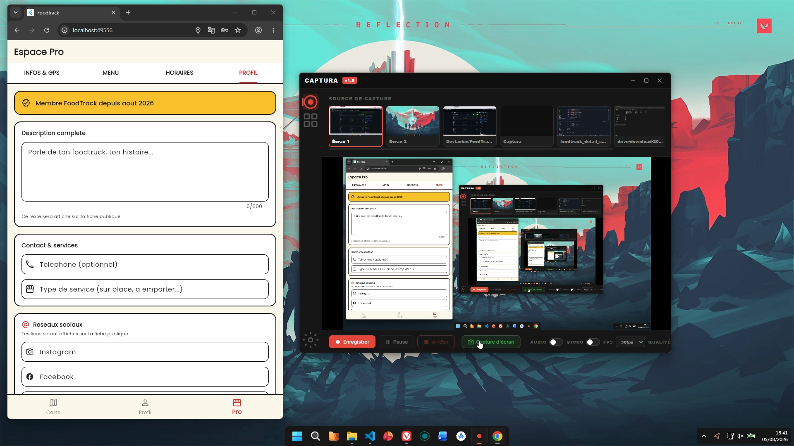
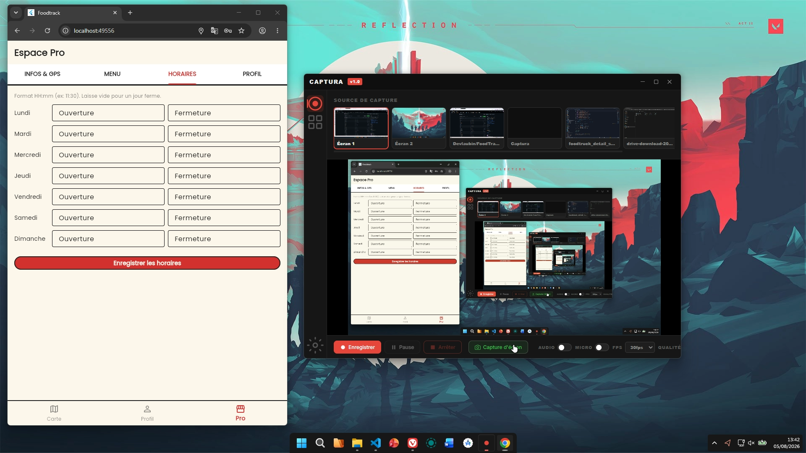

---

## Fonctionnalités

### Pour les utilisateurs

|                         |                                                                                                                                    |
| ----------------------- | ---------------------------------------------------------------------------------------------------------------------------------- |
| **Carte interactive**   | Visualise les food trucks sur une carte OpenStreetMap avec marqueurs colorés par type de cuisine.                                  |
| **Géolocalisation**     | Centrage automatique sur ta position et flèche indiquant ta direction en temps réel.                                               |
| **Recherche & filtres** | Recherche par nom, type de cuisine, « ouverts maintenant », `près de moi`, et tri (pertinence, distance, nom, ouverts en premier). |
| **Fiches détaillées**   | Menu par catégories, horaires hebdomadaires, bio, services et réseau(x) sociaux.                                                   |
| **Avis & notes**        | Note les food trucks, laisse un commentaire, édite ou supprime ton avis.                                                           |
| **Support**             | Signale un bug, propose une amélioration ou signale un utilisateur, et suis tes envois.                                            |

### Pour les propriétaires (Pro)

|                                |                                                                                     |
| ------------------------------ | ----------------------------------------------------------------------------------- |
| **Création guidée**            | Assistant en 3 étapes pour créer ta fiche (nom, type de cuisine, logo).             |
| **Position GPS en temps réel** | Mets à jour ta position en un clic pour apparaître sur la carte des clients.        |
| **Gestion du menu**            | Ajoute, modifie, supprime des articles et gère leur disponibilité.                  |
| **Horaires**                   | Définis les horaires d'ouverture jour par jour.                                     |
| **Profil pro**                 | Bio, téléphone, service (sur place / à emporter) et liens vers tes réseaux sociaux. |

---

## Stack technique

| Domaine             | Technologie                                                             |
| ------------------- | ----------------------------------------------------------------------- |
| **Mobile**          | [Flutter](https://flutter.dev/) + Dart                                  |
| **Carte**           | [flutter_map](https://pub.dev/packages/flutter_map) + **OpenStreetMap** |
| **Géolocalisation** | [geolocator](https://pub.dev/packages/geolocator) (position + cap)      |
| **Backend & Auth**  | [Supabase](https://supabase.com/) (Auth + PostgreSQL)                   |
| **Gestion d'état**  | [Provider](https://pub.dev/packages/provider)                           |
| **Typographies**    | [google_fonts](https://pub.dev/packages/google_fonts) (Poppins)         |
| **Deep links**      | [url_launcher](https://pub.dev/packages/url_launcher)                   |

> Le backend est entièrement géré par **Supabase** : authentification, base de données PostgreSQL, contraintes métier et **RLS (Row Level Security)** activées sur toutes les tables. Les migrations SQL sont versionnées dans le dossier `supabase/`.

---

## Arborescence

```text
foodtruck_app/
├── lib/
│   ├── app/               # Routage & état global de l'application
│   ├── config/            # Configuration (Supabase, etc.)
│   ├── domain/            # Modèles métier (FoodTruck, MenuItem, Review…)
│   ├── screens/           # Écrans (carte, détail, profil, auth, pro, support)
│   ├── services/          # Services (auth, foodtrucks, reviews, reports, pro)
│   ├── theme/             # Direction artistique (couleurs, thème)
│   ├── utils/             # Helpers & formatage
│   └── widgets/           # Composants réutilisables
├── assets/                # Logos & ressources
├── supabase/              # Schéma SQL & migrations (profil, foodtrucks, menu…)
├── img/                   # Captures d'écran
├── test/                  # Tests
├── pubspec.yaml
└── README.md
```

---

## Installation & démarrage

### Prérequis

- [Flutter SDK](https://docs.flutter.dev/get-started/install) (version 3.x)
- Un projet **Supabase** configuré (URL + clé anon)

### Étapes

```bash
# 1. Cloner le dépôt
git clone <url-de-ton-depot>
cd foodtruck_app

# 2. Installer les dépendances
flutter pub get

# 3. Configurer Supabase
#    Renseigne SUPABASE_URL et la clé anon dans lib/config/supabase_config.dart

# 4. Appliquer le schéma de base de données
#    Importe les fichiers de supabase/ dans la console Supabase (SQL Editor)

# 5. Lancer l'application
flutter run
```

---

## Direction artistique

L'interface suit une direction claire et cohérente :

- **Rétro & gourmand** — couleurs vintage et typographies marquées (Poppins) ;
- **Néo-brutaliste adouci** — angles arrondis, bordures noires épaisses et ombres nettes ;
- **Effet « objet physique »** — stickers avec contours noirs prononcés et ombres offset ;
- **Palette signature** — crème vintage, rouge ketchup, vert pickle, jaune moutarde.

L'objectif : une UI lisible, performante et pleine de personnalité.

---

## Roadmap

### V1 — Les bases qui font plaisir ✅

- Carte interactive, recherche & filtres
- Fiche food truck (menu + horaires)

### V2 — Construire une communauté ✅

- Comptes client / pro, authentification & vérification email
- Avis & notes

### V3 — Du « temps réel » qui claque 🔜

- Mise à jour des positions / événements
- Notifications push

### V4 — Public API & fonctionnalités avancées 🔜

- Commande
- Paiement
- API publique documentée

---

## Contribuer

**FoodTrack** est open source : tu peux contribuer aux écrans, au backend, aux performances et à la direction artistique.

- Ouvre une **issue** pour proposer une fonctionnalité ou signaler un bug ;
- Crée une **pull request** avec un résumé clair de tes changements ;
- Consulte le dossier `Markdown/` pour les spécifications détaillées.

---

## Licence

Distribué sous licence **MIT** — voir le fichier [`LICENSE`](LICENSE).
